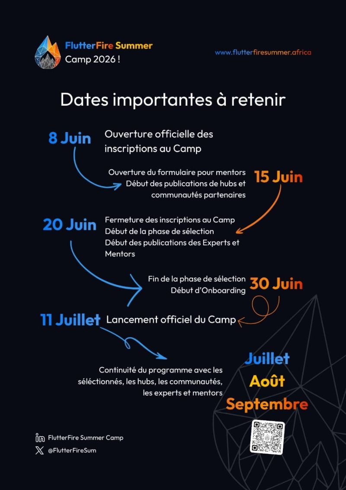
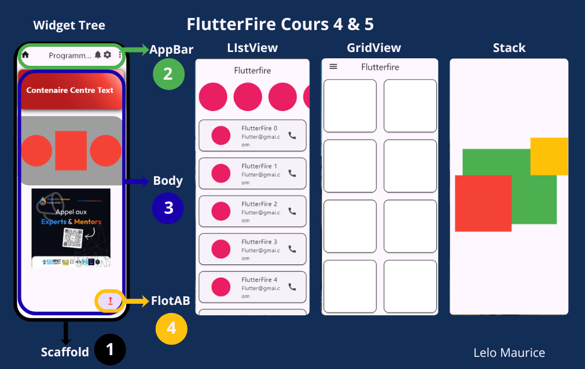

# leloflutter

Un projet Flutter démontrant les widgets de base et la navigation.

## 📥 Installation

```bash
# Cloner le dépôt
git clone https://github.com/leloeduk/flutterfire_lelo.git

# Aller dans le dossier du projet
cd leloflutter

# Installer les dépendances
flutter pub get

# Lancer l'application
flutter run
```

## 🍴 Fork & Contribuer

1. Fork ce dépôt
2. Créez votre branche (`git checkout -b feature/NouvelleFonctionnalité`)
3. Commitez vos changements (`git commit -m 'Ajout d'une nouvelle fonctionnalité'`)
4. Poussez la branche (`git push origin feature/NouvelleFonctionnalité`)
5. Ouvrez une Pull Request

## 📱 Captures d'écran

| Première Page                                  | Page d'accueil                               |
| ---------------------------------------------- | -------------------------------------------- |
|  |  |

## 🗺️ Plan de cours



## 🧩 Widgets Utilisés (Explications en une ligne)

### `main.dart`

- **`runApp()`** — Point d'entrée qui lance l'application Flutter
- **`MaterialApp`** — Widget racine fournissant le routage, le thème et la localisation
- **`StatelessWidget`** — Widget immuable qui ne change jamais d'état
- **`MyApp`** — Widget d'application personnalisé configurant le thème et la page d'accueil

### `first_page.dart`

- **`Scaffold`** — Structure de base visuelle avec appBar, drawer, body
- **`AppBar`** — Barre d'application en haut avec titre et actions
- **`Drawer`** — Panneau de navigation latéral (vide ici)
- **`ListView`** — Liste défilante de widgets
- **`SizedBox`** — Conteneur vide de taille fixe pour l'espacement
- **`ListView.builder`** — Construit efficacement des listes défilantes à la demande
- **`CircleAvatar`** — Widget circulaire pour afficher images/icônes
- **`Padding`** — Ajoute de l'espace autour du widget enfant
- **`Card`** — Carte Material Design avec élévation et coins arrondis
- **`ListTile`** — Ligne unique de hauteur fixe avec widgets leading/trailing
- **`Text`** — Affiche du texte stylisé
- **`Icon`** — Affiche des icônes Material Design

### `home_page.dart`

- **`StatefulWidget`** — Widget avec état mutable qui change dans le temps
- **`Column`** — Dispose les enfants verticalement
- **`Container`** — Boîte avec décoration, padding, marges, contraintes
- **`BoxDecoration`** — Décoration visuelle (couleur, gradient, bordure, ombre)
- **`LinearGradient`** — Remplissage en gradient entre deux couleurs
- **`BoxShadow`** — Effet d'ombre portée
- **`BorderRadius`** — Coins arrondis pour les conteneurs
- **`Center`** — Centre son widget enfant
- **`Row`** — Dispose les enfants horizontalement
- **`MediaQuery`** — Fournit la taille d'écran et infos appareil
- **`Image.asset`** — Affiche des images depuis les assets
- **`FloatingActionButton`** — Bouton flottant pour action principale
- **`IconButton`** — Icône qui réagit aux pressions
- **`setState()`** — Déclenche la reconstruction de l'UI quand l'état change

### `second_page.dart`

- **`Stack`** — Empile les widgets enfants les uns sur les autres
- **`Positioned`** — Positionne un enfant de manière absolue dans le Stack
- **`Clip.none`** — Autorise les enfants du Stack à déborder au-delà des limites

### `third_page.dart`

- **`GridView.builder`** — Crée une grille défilante d'éléments à la demande
- **`SliverGridDelegateWithFixedCrossAxisCount`** — Grille à nombre fixe de colonnes
- **`Card`** — Carte Material Design avec élévation et coins arrondis
- **`RoundedRectangleBorder`** — Forme de carte aux coins arrondis

## 🛠️ Construit avec

- [Flutter](https://flutter.dev/) - Framework UI
- [Dart](https://dart.dev/) - Langage de programmation
- [leloEduk] (https://www.youtube.com/@LeloEduk) - chaine youtube

## 📄 Licence

Ce projet est sous licence MIT.
